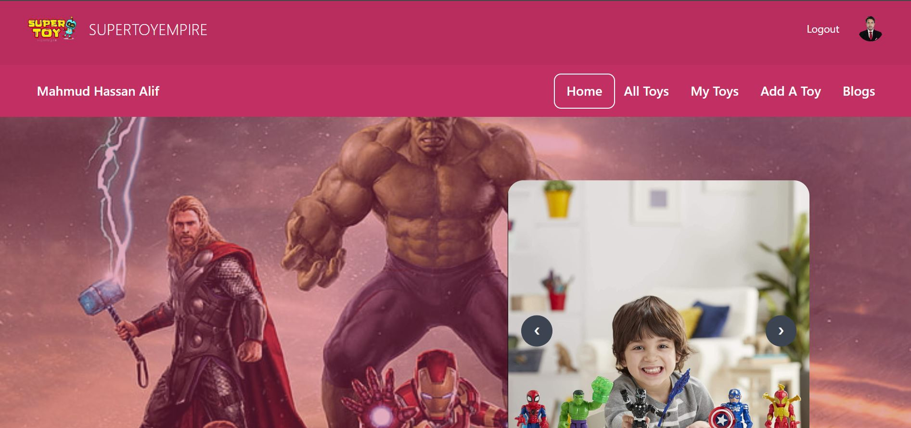

# Project Title
This is a sports-related MERN stack project.

## Table of Contents

- [Project Overview](#project-overview)
- [Project Links](#Project-Links)
- [Technologies Used](#technologies-used)

## Project Overview

this is a sports-related application there are 3 types of rules admin instructor and user admin can manage and admin can create new admin, instructor there are 3 different types of dashboards and the user cannot enter admin and the instructor cannot enter admin.  everywhere is secure.

## Project Links

- [Live Demo](https://summer-camp-71b55.web.app/)
- [git Client link](https://github.com/alif819015/summer-camp-client)
- [git Server link](https://github.com/alif819015/summer-camp-server)

## Technologies Used

List the key technologies and tools used in your project. Use badges if available.

Technology:

- 
- 
- 
- 
- 
- 
- 
- 
- 
- 
- 
- 
- 
- 
- 
- 

# Project Title

## Table of Contents

- [Project Overview1](#project-overview)
- [Project Links1](#Project-Links)
- [Technologies Used1](#technologies-used)

## Project Overview1

this is a super toy application here a user can select any class and can see his selected classes in his own round and all selected classes can be seen and here the user can update any information if he wants. Block route is kept here.

## Project Links1

- [Live Demo](https://toy-marketplace-d6ceb.web.app/)
- [git Client link](https://github.com/alif819015/toy-marketplace-client)
- [git Server link](https://github.com/alif819015/toy-marketplace-server)

## Technologies Used1

List the key technologies and tools used in this project.

Technology:

- 
- 
- 
- 
- 
- 
- 
- 
- 
- 
- 
- 
- 
- 